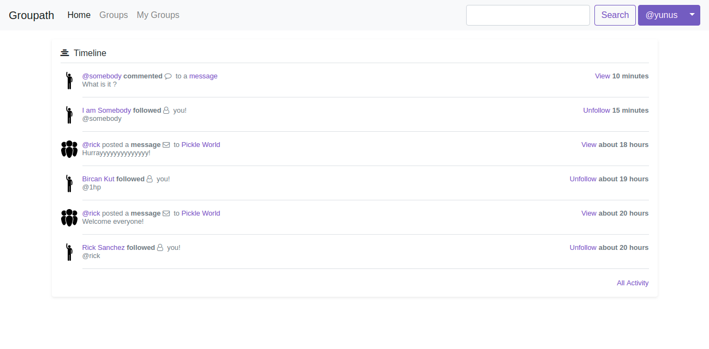
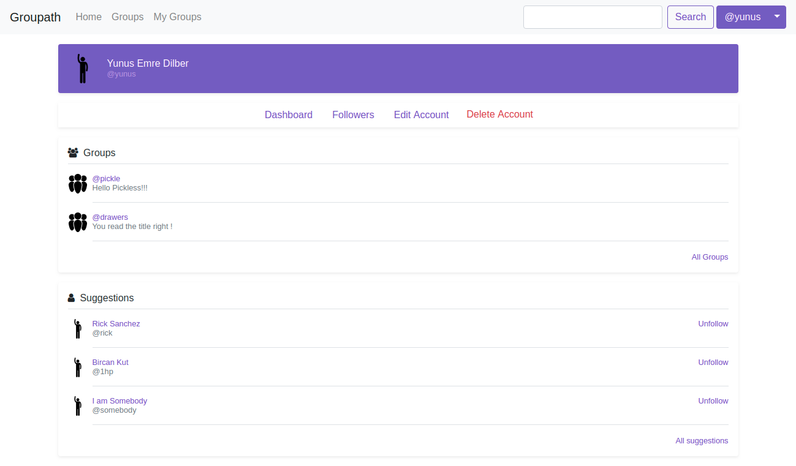
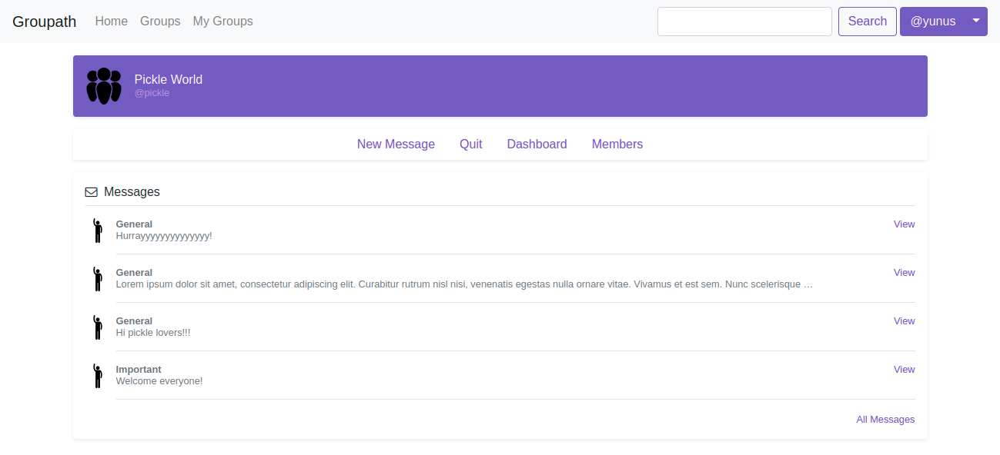
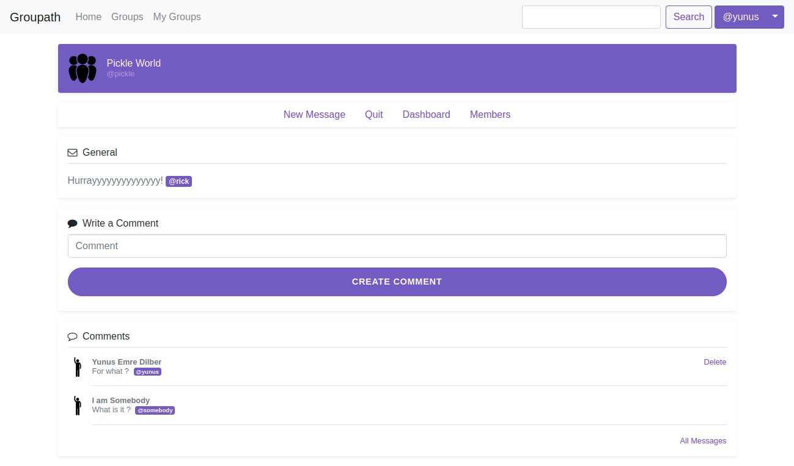

# Groupath

> You can view this project live on https://groupathx.herokuapp.com .
> Please use this site only for test proposes.

Groupath is a social platform for groups.

* We can signup, login and logout. Our passwords encoded with bcrypt.
* We can follow other users and they can follow too.
* We can join a group and get access for view messages or write a new one.
* We can create a group, edit or delete.
* We can search group, message, user or comment.
* We can create a comment to a message.
* We can see everything related to us on our dashboard.

**Db diagram is [here](https://dbdiagram.io/d/5d2ed4a3ced98361d6dcbc34).**

> Ruby version: 2.5.1 |
> Rails version: 5.2.3

> Database: postgresql

### Quick start on Ubuntu

1. `sudo apt-get install postgresql postgresql-contrib libpq-dev` Install postgresql
1. `sudo -u postgres createuser -s pguser` create a db user named 'pguser'. (You can -**and should**- change it.)
1. `sudo -u postgres psql` Go to postgres console.
1. `\password pguser` Set a new password (Yo can close this console by entering `\q`)
1. Change username & password field in *config/database.yml*
1. `rake db:create db:migrate` Create and migrate database.
1. `rails s` Start the server :smile:

### Screenshots

### Used
* [bootstrap-rubygem](https://github.com/twbs/bootstrap-rubygem)
* [email_validator](https://github.com/balexand/email_validator)
* [font-awesome-rails](https://github.com/bokmann/font-awesome-rails)

### How everything works ?

#### Application Controller

In our *app/controllers/application_controller*
we have a few methods.

##### current_user
This method sets @current_user and we are getting an User object with is our signed user.
This method is also helper method.

##### signed_in?
This method uses current_user method. (Also helper_method)

##### current_users_follows
We are getting an array of ids. (Also helper_method)
### Deploy
You can check [here](https://devcenter.heroku.com/articles/getting-started-with-rails5)
to learn how to deploy your app to heroku.

> Yunus Emre Dilber
> @yunusemredilber
